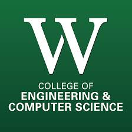
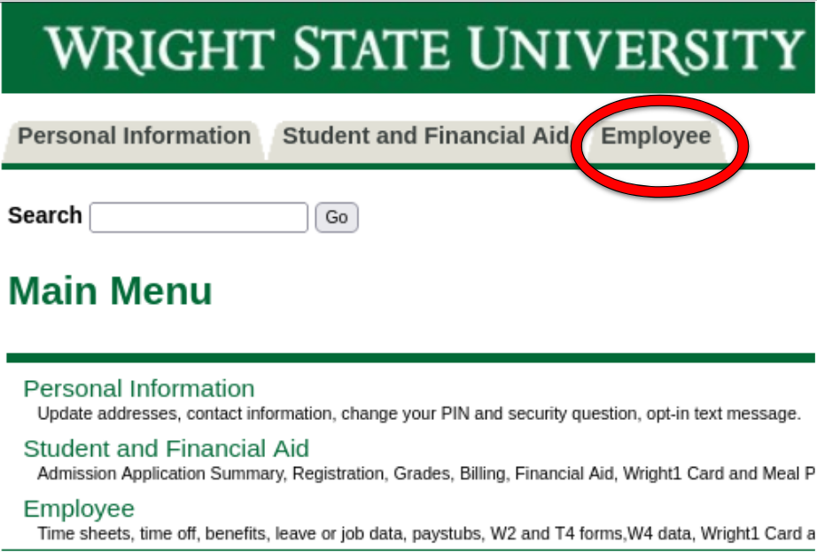
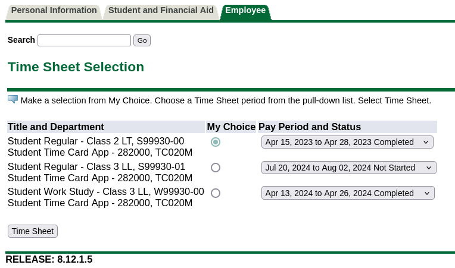

  

<h3 align="center"><strong>TA-Handbook</strong></h3>

  Onboarding guide for new teaching assistants
   

## Table of Contents
- [Getting Started](#getting-started)
- [Clocking Hours](#clocking-hours)
- [What can be clocked:](#what-can-be-clocked)
- [Forgetting to Submit your Timesheet](#forgetting-to-submit-your-timesheet)
- [Working well with students](#working-well-with-students)
- [Grading](#grading)
   * [Grading Bias ](#grading-bias)
- [Help Rooms](#help-rooms)
- [Office Hours](#office-hours)
- [Discord](#discord)
- [Classes:](#classes)
- [Course Evaluations:](#course-evaluations)

## Getting Started
So you've been hired as a CS/CEG Teaching Assistant (TA). Congratuations 🥳.
You can treat this repository as a general guide to being a TA. You'll meet many 
of many great people and students in the department. It's a great networking and learning opportunity.

## Clocking Hours
1. To clock hours, first go to [Wings Express](https://wingsexpress.wright.edu/)
You should have a new employee tab here.

2. From here, select the timesheet tab.
If you have multiple positions at the university, here is where you can select 
which timesheet to bill your hours for which job. This includes work-study positions. If 
this is your only position (and you haven't changed to/from a work-study) you will likely only
have a single selection

3. Hours can be clocked on this screen in 2-week period. It is recommended to fill 
this out as you work. At the end of the 2-week period, you'll receive an email from payroll saying that
timesheets are due sometime soon. This is your cue to go to this page and hit the `Submit for Approval` button.
After a few days, your timesheet approver will (hopefully) approve your hours and will be paid the following Thursday.
*DO NOT CLOCK MORE THAN 28 HOURS PER WEEK* (56 per pay period) If you do so, your employment will be terminated, and you will have to be
rehired to fix it. 

## What can be clocked:
Any job related work may be clocked in your timesheet. This includes, but is defintely not limited to:
- Meetings
- Grading
- Labs
- Office Hours
- Answering a bunch of angry student emails
- Writing guides in a repository for future TAs
Just make sure you don't work for free and that your timesheet accurately reflects the hours you worked. Having some tractability here
is helpful, but not strictly necessary.

## Forgetting to Submit your Timesheet
We have all done this before. You got the timesheet email, but it just slips away sometimes.
The first thing to do is to go the payroll department in 204 University Hall. They'll get you a paper timesheet to fill out instead. 
Check out [this guide](resources/Blank-Time-Sheet-with-Instructions-and-Example-New.pdf) for more detailed instructions on filling these out.
You will need a physical signature from your usual timesheet approver.
If you are able to get your paper timesheet approved before the standard deadline (usually the following Monday at noon) you'll
still be paid at the usual time. If not, it will go onto your paycheck

## Working well with students

Working well with students is probably what you'll be doing most often as a TA. You were hired because somebody was
confident that you were one of the best people for this job. The difficult part comes from clearly communicating that 
to students. A good TA is clear and approachable, while also being empathetic.  

- Clarity: To be as clear as you can be when conveying a concept to a student, you will likely need multiple ways of explaing
it. Having a handful of different, but linked ideas of a concept is something that comes with time, but will greatly benefit
students unstanding of your explanation. 

- Approachability: Students tend to get the most of labs if they are not afraid to ask the TA a "stupid" question. Being casual and approachable
really helps students feel comfortable and facilitates a better learning environment

- Empathy: Stuff happens. Life is chaotic and people's lives are unpredictable. You should account for this in all things and if
students ask for a deadline extension for a valid reason, make reasonable accomadations. Balancing empathy and being fair to everyone can be challenging.

## Grading
How your class does grading is generally pretty class-dependent. If the students have some sort of Pilot Deliverable, it can
be accessed through the course Pilot page's DropBox section. Pilot will let you do 4 things for each student
- Score it
- Give Feedback
- Save grade as draft
- Publish grade to student
The general advice here is to always give feedback telling students what they missed according to the assignment rubric.
Try to grade all assignments as a draft and then publish them all at once.

### Grading Bias 
Everyone grades a little bit differently. A rubric is a starting place for ensuring consistency, but submissions are
almost always more nuanced than a simple rubric can account for. If there is only a single grader, this is less of an issue, 
as the one grader will apply the same bias to each student, but gets harder when you have more graders.
Generally, there are two approaches to solving this problem. It is heavily encouraged that one of these is followed to avoid
grading bias in student grades

- Central Authority:
Audit all graders proposed scores through a central authority (often a lab leader) to ensure that all graders
docked the same number of points for similar offenses

- Rotation:
Rotate which grader is responsible for grading which student submissions. For instance, if you had 2 grades and 50 students,
Grader A would evaluate students 0-25 and Grader B would evaluate students 26-50. On the following week, have Grader A evaluate 26-50 and B evaluate 0-25

These methods can and should be used in tandem with one another for more consistent student evaluation.

## Help Rooms
There are several help rooms in the department
- Programming and Discrete Math Help Room
This is the effective CS help room. Many people chose to host their office hours
here if is it not busy at their chosen time. It currently supports the following courses
    - CS 1180
    - CS 1181
    - CS 1160
    - CS 2200
    - MTH 2570
    - CEG 2170
    It is primarily focused on CS118X for the time being, as those are the TAs who are generally staffing it. For more information,
    check out the [departments guide](https://engineering-computer-science.wright.edu/computer-science-and-engineering/help-room)
- Electrical Engineering Help Room
    Undergraduate students taking EE courses can get help by visiting the EE help room. For more information,
    check out the [departments guide](https://www.wright.edu/student-success/academic-support/walk-in-departmental-help-rooms)
- Dr. Taylor Informal Help Room
    Dr. Taylor's help room is an informal option to point students to if they are having more general difficulties. Areas of help are:
    - Understanding the importance of discrete mathematics in Computer Science & Engineering
    - How to improve comprehension
    - Basic math problem-solving and study skills
    - How to develop a computer code starting with a basic problem statement
    - Long and short-range options regarding the major of your degree

## Office Hours

If you are a lab leader, you are required to hold weekly office hours. This is time for students to get more personalized
help and/or feedback regarding course-related materials. You are required to hold a minimum of 2 office hours per week. This number can be
increased based on need. But this only applies within reason (i.e. don't hold 10 extra hours one week because you just wanted more hours)
There should be a dedicated space somewhere for you to hold these, but that can move if it is needed, see [helproom](##help-room)

## Discord

The CECS department has a discord server. It acts as a central hub for more informal communication about courses.
Every semester, you can select roles depending on what classes you are taking (or in this case teaching). Students can
use this to ask questions, where you can answer them in a public manner to benefit all students. 
Join the discord [here](https://discord.com/invite/pMUMzTt).

## Classes:
If you are interested in your particular course resources, check out `classes/[your_class].md` for a more detailed guide.
If your class does not exist, feel free to make a PR.

## Course Evaluations:
At the end of every semester, students are asked to give course evaluations for their professors and Teaching Assistants.
You will have to ask students to fill these out if you want real feedback. Traditionally, only about 5% of students will fill them out otherwise. 
These evaluations are made available to the professor only after final grades have been published. You can ask the course professor
for your evaluation past this date if you are interested

